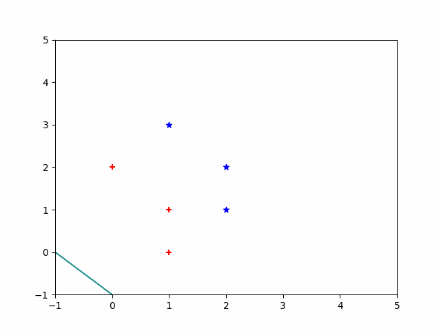
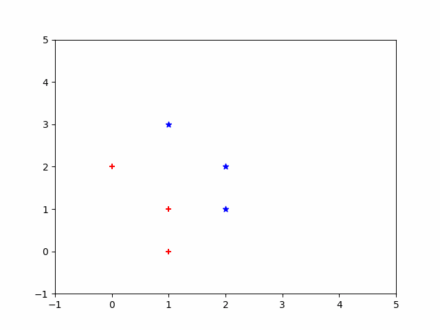
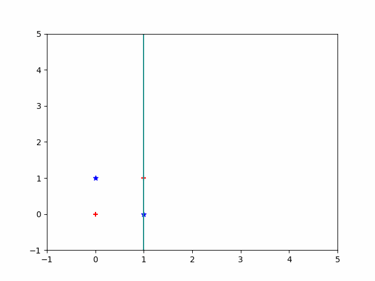

[TOC]

# 实验一 固定增量法求分界面

## 实验目的

1. 了解感知机算法
2. 实现感知机算法
3. 认识感知机算法的优点和局限性

## 实验要求

* 已知二维模式样本集 X^1^ = { (1 0),  (1 1), (0 2) } , X^2^ = { (2 1),  (2 2), (1 3) }，用固定增量算法求分界面方程，并作图
* 分别改变初始权向量和样本集中的样本顺序来获得不同的结果
* 自定义线性不可分样本 （如 X^1^ = { (0 0),  (1 1) } , X^2^ = { (1 0),  (0 1) }），通过限定算法迭代次数（如100次）得到结果并分析
* 分析实验结果和所得结论，撰写实验报告

## 实验原理

### 感知机模型介绍

**定义.感知机**：假设输入空间 ![[公式]](https://www.zhihu.com/equation?tex=%5Cmathcal%7BX%7D+%5Csubseteq+R%5E%7Bn%7D) ，输出空间 ![[公式]](https://www.zhihu.com/equation?tex=%5Cmathcal%7BY%7D+%3D+%5Cleft%5C%7B%2B1%2C+-1+%5Cright%5C%7D) 。输入 ![[公式]](https://www.zhihu.com/equation?tex=x+%5Cin+%5Cmathcal%7BX%7D) 表示实例的特征向量，对应于输入空间的点；输出 ![[公式]](https://www.zhihu.com/equation?tex=y+%5Cin+%5Cmathcal%7BY%7D) 表示实例的类别。由输入空间到输出空间的函数

![[公式]](https://www.zhihu.com/equation?tex=%5Cbegin%7Balign%2A%7D+%5C%5C%26+f+%5Cleft%28+x+%5Cright%29+%3D+sign+%5Cleft%28+w+%5Ccdot+x+%2B+b+%5Cright%29+%5Cend%7Balign%2A%7D+%5C%5C)

称为感知机。其中， ![[公式]](https://www.zhihu.com/equation?tex=w) 和 ![[公式]](https://www.zhihu.com/equation?tex=b) 为感知机模型参数， ![[公式]](https://www.zhihu.com/equation?tex=w+%5Cin+R%5E%7Bn%7D) 叫做权值或权值向量， ![[公式]](https://www.zhihu.com/equation?tex=b+%5Cin+R) 叫偏置， ![[公式]](https://www.zhihu.com/equation?tex=w+%5Ccdot+x) 表示 ![[公式]](https://www.zhihu.com/equation?tex=w) 和 ![[公式]](https://www.zhihu.com/equation?tex=b) 的内积。 ![[公式]](https://www.zhihu.com/equation?tex=sign) 是符号函数，即

![[公式]](https://www.zhihu.com/equation?tex=%5Cbegin%7Balign%2A%7D+sign+%5Cleft%28+x+%5Cright%29+%3D+%5Cleft%5C%7B+%5Cbegin%7Baligned%7D+%5C+%26+%2B1%2C+x+%5Cgeq+0+%5C%5C+%26+-1%2C+x%3C0+%5Cend%7Baligned%7D+%5Cright.%5Cend%7Balign%2A%7D+%5C%5C)

感知机是一种线性分类模型，属于判别模型。感知机模型的假设空间是定义在特征空间中的所有线性分类模型或线性分类器，即函数集合 ![[公式]](https://www.zhihu.com/equation?tex=%5Cleft%5C%7B+f+%7C+f+%5Cleft%28+x+%5Cright%29+%3D+w+%5Ccdot+x+%2B+b+%5Cright%5C%7D) 。

线性方程

![[公式]](https://www.zhihu.com/equation?tex=%5Cbegin%7Balign%2A%7D+%5C%5C%26+w+%5Ccdot+x+%2B+b+%EF%BC%9D+0+%5Cend%7Balign%2A%7D+%5C%5C)

对应于特征空间 ![[公式]](https://www.zhihu.com/equation?tex=R%5E%7Bn%7D) 中的一个超平面 ![[公式]](https://www.zhihu.com/equation?tex=S) ，其中 ![[公式]](https://www.zhihu.com/equation?tex=w) 是超平面的法向量， ![[公式]](https://www.zhihu.com/equation?tex=b) 是超平面的截距。超平面 ![[公式]](https://www.zhihu.com/equation?tex=S) 将特征空间划分为两部分，位于其中的点被分为正、负两类，超平面 ![[公式]](https://www.zhihu.com/equation?tex=S) 称为分离超平面。


### 感知机学习策略

### 算法

给定训练数据集

![[公式]](https://www.zhihu.com/equation?tex=%5Cbegin%7Balign%2A%7D+%5C%5C%26+T+%3D+%5Cleft%5C%7B+%5Cleft%28+x_%7B1%7D%2C+y_%7B1%7D+%5Cright%29%2C+%5Cleft%28+x_%7B2%7D%2C+y_%7B2%7D+%5Cright%29%2C+%5Ccdots%2C+%5Cleft%28+x_%7BN%7D%2C+y_%7BN%7D+%5Cright%29+%5Cright%5C%7D+%5Cend%7Balign%2A%7D+%5C%5C)

其中， ![[公式]](https://www.zhihu.com/equation?tex=x_%7Bi%7D+%5Cin+%5Cmathcal%7BX%7D+%3D+R%5E%7Bn%7D%2C+y_%7Bi%7D+%5Cin+%5Cmathcal%7BY%7D+%3D+%5Cleft%5C%7B+%2B1%2C+-1+%5Cright%5C%7D%2C+i+%3D+1%2C+2%2C+%5Ccdots%2C+N) 。求参数 ![[公式]](https://www.zhihu.com/equation?tex=w) 和 ![[公式]](https://www.zhihu.com/equation?tex=b) ，使其为以下损失函数极小化问题的解

![[公式]](https://www.zhihu.com/equation?tex=%5Cbegin%7Balign%2A%7D+%5C%5C%26+%5Cmin_%7Bw%2Cb%7D+L+%5Cleft%28+w%2C+b+%5Cright%29+%3D+-%5Csum_%7Bx_%7Bi%7D+%5Cin+M%7D+y_%7Bi%7D+%5Cleft%28+w+%5Ccdot+x_%7Bi%7D+%2B+b+%5Cright%29+%5Cend%7Balign%2A%7D+%5C%5C)

其中， ![[公式]](https://www.zhihu.com/equation?tex=M) 为误分类点的集合。

感知机学习算法是误分类驱动的，采用随机梯度下降法 stochastic gradient descent。极小化过程中不是一次使用$M$中所有误分类点的梯度下降，而是一次随机选取一个误分类点使其梯度下降。

假设误分类点集合 ![[公式]](https://www.zhihu.com/equation?tex=M) 是固定的，则损失函数 ![[公式]](https://www.zhihu.com/equation?tex=L+%5Cleft%28+w%2C+b+%5Cright%29) 的梯度

![[公式]](https://www.zhihu.com/equation?tex=%5Cbegin%7Balign%2A%7D+%5C%5C%26+%5Cnabla+_%7Bw%7D+L+%5Cleft%28+w%2C+b+%5Cright%29+%3D+-%5Csum_%7Bx_%7Bi%7D+%5Cin+M%7D+y_%7Bi%7D+x_%7Bi%7D+%5C%5C+%26+%5Cnabla+_%7Bb%7D+L+%5Cleft%28+w%2C+b+%5Cright%29+%3D+-%5Csum_%7Bx_%7Bi%7D+%5Cin+M%7D+y_%7Bi%7D+%5Cend%7Balign%2A%7D+%5C%5C)

随机选取一个误分类点 ![[公式]](https://www.zhihu.com/equation?tex=%5Cleft%28+x_%7Bi%7D%2C+y_%7Bi%7D+%5Cright%29) ，对 ![[公式]](https://www.zhihu.com/equation?tex=w%2C+b) 进行更新：

![[公式]](https://www.zhihu.com/equation?tex=%5Cbegin%7Balign%2A%7D+%5C%5C%26+w+%5Cleftarrow+w+%2B+%5Ceta+y_%7Bi%7D+x_%7Bi%7D+%5C%5C+%26+b+%5Cleftarrow+b+%2B+%5Ceta+y_%7Bi%7D+%5Cend%7Balign%2A%7D+%5C%5C)

其中， ![[公式]](https://www.zhihu.com/equation?tex=%5Ceta+%5Cleft%28+0+%3C+%5Ceta+%5Cleq+1+%5Cright%29) 是步长，称为学习率。

### 收敛性

* 对线性可分的样本集，感知机算法能在有限步长内完成收敛
* 对线性不可分的样本集，感知机算法不能收敛

## 实验实现（python)

本次实验固定了学习率，所以算法实现比较简答，具体实现细节

1. 固定增长率为1

2. 用增值特征向量表示样本，并且对X2类的样本进行取反操作

3. W迭代

   ```python
   for data in datasets:
       if W * data <= 0:
           W = W + lr * data
   ```

具体 算法实现图下

```python
import numpy as np
from drawgif import draw
lr = 1		#学习率

if __name__ == "__main__":
    data = []
    # X1类
    data.append(np.array([1,0,1], dtype=float))
    data.append(np.array([1,1,1], dtype=float))
    data.append(np.array([0,2,1], dtype=float))

    # X2类
    data.append(np.array([-2,-1,-1], dtype=float))
    data.append(np.array([-2,-2,-1], dtype=float))
    data.append(np.array([-1,-3,-1], dtype=float))


    #init 
    W = np.array([1,1,1], dtype=float)	
    #Wlist store the value of W in every round
    WList = []
    WList.append(W)
    round = 0
    status = False

    #begin
    while status is False:
        status = True	#用于验证算法是否已经收敛
        round = round + 1
        for i in range(len(data)):
            if np.dot(W, data[i]) <= 0:
                W = W + lr * data[i]
                status = False
            WList.append(W)
	print(round)
    draw(data, WList, "result1")	#绘制动态图
```

## 实验结果及分析

### 问题一 

* 已知二维模式样本集 X^1^ = { (1 0),  (1 1), (0 2) } , X^2^ = { (2 1),  (2 2), (1 3) }，用固定增量算法求分界面方程，并作图
* 答：此过程比较简单，可有算法输出对应结果和W变化情况：
  * 收敛轮数：round = 16
  * W变化（以轮数为更新粒度）：(1., 1., 1.) -> (-1.,  0.,  0.) -> (-2., -1.,  0.) -> (-2., -1.,  1.) -> (-2., -1.,  2.) -> (-3., -2.,  2.) -> (-3., -2.,  3.) -> (-3., -2.,  4.) -> (-4., -2.,  4.) -> (-4., -2.,  5.) -> (-4., -4.,  5.) -> (-5., -2.,  6.) -> (-5., -4.,  6.) -> (-4., -3.,  7.) -> (-5., -3.,  7.) -> (-4., -2.,  8.) -> (-4., -2.,  8.)
  * 动态图（以W每次变化会更新粒度）：
  * 最终收敛结果为判别函数为 y = - 4 * X~1~ - 2 * X~2~ + 8
  * 分界面为  - 4 * X~1~ - 2 * X~2~ + 8 = 0

### 问题二

* 分别改变初始权向量和样本集中的样本顺序来获得不同的结果

* 答：权向量初始值的改变和样本集中的样本顺序改变，影响最终结果和收敛轮数，但是不影响算法的收敛性。

  * init: W = (0,0,0)

    * 收敛轮数： round = 6
    * 最终判别函数： y = - 2 * X~1~ - 1 * X~2~ + 4
    * 动态图（以W每次变化会更新粒度）：
    * 初始化W = (0, 0, 0)，最终结果没有发生变化，但是相比16轮，仅用6轮就完成收敛，大大加快了收敛速度

  * 改变样本集顺序：对data = X~1~  ∪ X~2~  ，对data进行随机洗牌

    * W = (0, 0, 0)

    * data 变化:

      ```python
      #初始
      (1., 0., 1.), 
      (1., 1., 1.), 
      (0., 2., 1.), 
      (-2., -1., -1.), 
      (-2., -2., -1.), 
      (-1., -3., -1.)
      #随机洗牌后
      (0., 2., 1.), 
      (-2., -1., -1.), 
      (-1., -3., -1.), 
      (1., 0., 1.), 
      (1., 1., 1.), 
      (-2., -2., -1.)
      ```

    * 收敛轮数：round = 4

    * 最终判别函数： y = - 2 * X~1~ - 1 * X~2~ + 4

    * 随机打乱样本顺序，对最终结构也没有影响，但是能影响收敛轮数，仅用四轮就收敛了

    * 动态图（以W每次变化会更新粒度）：

  * 改变学习率：

    * W = (1, 1, 1)
    * lr = 0.01
    * 收敛轮数：round = 26
    * 最终判别函数： y = - 0.11 * X~1~ - 0.18 * X~2~ + 0.38
    * 动态图（以W每次变化会更新粒度）：
    * lr直接影响收敛速度，当lr过小时，收敛速度非常慢，当lr过大时，可能不能收敛
    
### 问题三
* 自定义线性不可分样本 （如 X^1^ = { (0 0),  (1 1) } , X^2^ = { (1 0),  (0 1) }），通过限定算法迭代次数（如100次）得到结果并分析

* 答：自定义样本集为 X^1^ = { (0 0),  (1 1) } , X^2^ = { (1 0),  (0 1) }

  * 初始化 W = [1 0  -1]

  * lr  = 0.1

  * 在这种情况下，算法不会收敛，所以我们限制迭代轮数为50次

  * 在稳定下来后，W按照以下循序进行轮转

    * ```python
      [ 0.1  0.1 -0.1]
      [ 1.38777878e-16  1.00000000e-01 -2.00000000e-01]
      [ 1.38777878e-16  1.00000000e-01 -1.00000000e-01]
      [ 1.00000000e-01  2.00000000e-01 -1.38777878e-16]
      ```

  * 动态图（以W每次变化会更新粒度）：

  * 这种情况说明了，感知算法本身在训练时无法区分样本集是否线性可分

## 实验总结

本次算法，我使用python实现了感知机算法，通过本次实验，大致了解了感知机算法的优缺点和局限性

* 优点
  * 实现简单
  * 算法有限，在样本集线性可分时，在有限步骤内必定收敛
* 缺点
  * 只针对线性可分的情况能够收敛
  * W的初始化选择和样本集的取样顺序极大的影响了感知机收敛的速度

## Reference

[感知机（Perceptron）及python实现](https://zhuanlan.zhihu.com/p/38098165)