[TOC]

# 实验二 利用误差平方和函数集群 

## 实验目的

1. 了解并实现聚类算法
2. 分析误差平方和函数集群的优缺点

## 实验要求

1. 试就不同的初始分划，观察集群结果对初始分划的敏感性。 
2. 比较各群样本都很密集并且彼此明显分开的情况与各群样本数目相差很大时，误差平方和集群效果，了解误差平方和准则函数集群的优势和缺陷。
3. 试对算法进行适当改进使其可以对样本数目相差很大的情况进行集群，用文字叙述改进的思路。（选做） 
4. 给出以上各种情况的图形结果，撰写实验报告。 

## 实验原理

### 聚类算法

聚类分析又称群分析，它是研究（样品或指标）分类问题的一种统计分析方法，同时也是数据挖掘的一个重要算法。

聚类（Cluster）分析是由若干模式（Pattern）组成的，通常，模式是一个度量（Measurement）的向量，或者是多维空间中的一个点。

聚类分析以相似性为基础，在一个聚类中的模式之间比不在同一聚类中的模式之间具有更多的相似性。

### 误差平方和准则

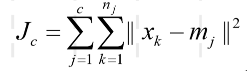

 若聚类算法以误差平方和准则为聚类准则，则在聚类过程中追求全体样本的误差平方和最小，其本质是一种近邻算法。

优点：

* 实现比较简单
* 对各类样本比较密集，且样本数目悬殊不大的样本分布效果比较好

缺点：

* 对样本分布比较松散，样本数目比较悬殊的样本分布不能很好的发挥作用

## 实验实现（python)

为了实现误差平方和函数集群，这里选择比较简单的`c-mean`算法一进行实验。

`c-mean`算法流程：

1. 给出n个混合样本，令 I = 1, 表示迭代运算的次数，选取c个初始聚合中心Z~j~(1)， j = 1, 2, ······，c;

2. 计算每个样本与聚合中心的距离D( X~k~, Z~j~(I) ), k = 1, 2, ......, n, j = 1,2,......, c;

   若D( X~k~, Z~i~(I) ) = min {D( X~k~, Z~j~(I) ), k = 1, 2, ......, n} 则X~k~属于 i 类

3. 计算c个新的集合中心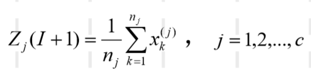

4. 判断：若Z~j~(I+1) != Z~j~(I), j = 1,2,......,c ， 则 I = I + 1， 返回2；否则算法接受


此处实验主要设计了三个函数，分别是`generate`，`draw`，`c_mean`。

* `generate`:正态分布生成离散样本
* `draw`: 画出聚类结果和初始样本生成结果
* `c_mean`: `c-mean`算法实现

### generate

```python
# (x, y)为均值
# (v_x, v_y)为两个维度的标准差
# num 为生成的样本集中样本的数目
# class_index 此样本的类别
# generate函数是生成一个正太分布的同属一类二维样本集
def generate(x : int, y : int, v_x : int, v_y : int, num : int, class_index : int):
    dim = 2							#二维
    s = np.random.randn(num, dim) 	#生成标准正态分布
    s = s * [v_x, v_y]				
    return np.insert(s, 2, values=class_index, axis=1) + [x, y, 0] #插入第三维，用于存放类别
```

### draw

```python
char = ["1","2","3","4","5","6","7","8","9","a","b","c","d","e","f"]

#get_random_color函数功能是得到从RGB颜色中随机挑一种
def get_random_color():
    color = "#"
    for i in range(6):
        color = color + str(random.sample(char,1)[0])
    return color

#s为总的样本集
#name为保存的文件名
def draw( s : list, name : str):
    plt.clf()
    plt.xlim((-10,10))	#划定图标的范围
    plt.ylim((-10,10))
    map = {}			#用于将class_index与其颜色对应起来
    for point in s:
        if point[2] in map.keys():
            color = map[point[2]]
        else:
            color = get_random_color()
            map[point[2]] = color
        plt.scatter(point[0], point[1], marker = "+", color=color)	
    plt.savefig(name)
```

### c_mean

```python
#distance的功能是计算两个点之间的欧拉距离的平方
def distance(p1 ,p2):
    dist = np.sum(np.square(p1-p2))
    return dist

#s为总的样本集
#num_class 为聚类算法分类的个数
def c_mean(s, num_class : int):
    round = 1		#轮数
    centers = []	
    index = random.sample([i for i in range(len(s))], 3)
    for i in index:
        centers.append(s[i][0:2])		#选取初始中心点

    while True:
        for point in s:					
            coords = point[0:2]			#coords 为样本的二维坐标
            dist = []
            for center in centers:		#计算各个样本到中心点的距离
                dist.append(distance(center, coords))
            point[2] = dist.index(min(dist))	#更新各个样本的标签
       
        new_center = np.zeros((3,2))	
        count = [0] * num_class
        for point in s:					#计算新的中心点
            token = int(point[2])
            count[token] += 1
            new_center[token] += point[0:2]
            
        flag = True
        for i in range(num_class):
            new_center[i] = new_center[i] / count[i]
            if distance(new_center[i], centers[i]) > 1e-5:	#新旧中心点不同，所有更新聚类中心
                flag = False								#并且分类继续
                centers[i] = new_center[i]
        
        if flag:
            break

        round += 1
    
    return centers, s
```

## 实验结果分析

`c-mean`算法以最小误差平方和为准则函数，能够对各类样本比较密集，且样本数目悬殊不大的样本分布进行正确的聚类。

### case1

如样本集：

```python
    class1 = generate(0, 0, 1, 1, 100, 0)	#中心为(0,0), 标准差为(1,1), 数目为100个
    class2 = generate(5, 5, 1, 1, 100, 1)	#中心为(5,5), 标准差为(1,1), 数目为100个
    class3 = generate(-5, -5, 1, 1, 100, 2)	#中心为(-5,-5), 标准差为(1,1), 数目为100个
    s = np.vstack((class1, class2, class3))	#讲三类样本聚合
    #初始划分随机选择
```

其分布图像为：

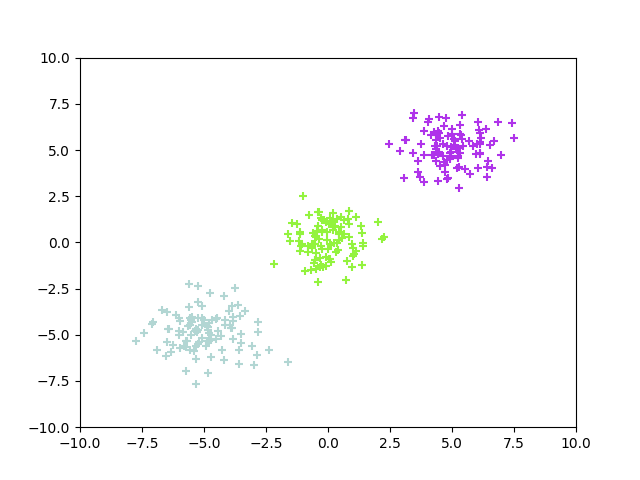

在对s进行聚类算法，得到以下结果：

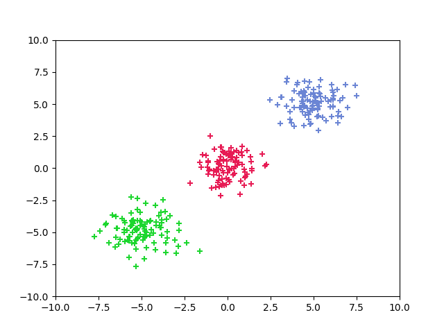

可以看到`c-mean`算法对各个样本正确的完成分类

### case2

对各个样本分布不是非常密集的样本集进行聚类操作

```python
    class1 = generate(0, 0, 1, 1, 100, 0)	#中心为(0,0), 标准差为(1,1), 数目为100个
    class2 = generate(5, 5, 2, 2, 100, 1)	#中心为(5,5), 标准差为(2,2), 数目为100个
    class3 = generate(-5, -5, 2, 2, 100, 2)	#中心为(-5,-5), 标准差为(2,2), 数目为100个
    s = np.vstack((class1, class2, class3))	#讲三类样本聚合
    #初始划分随机选择
```

生成的样本分布：

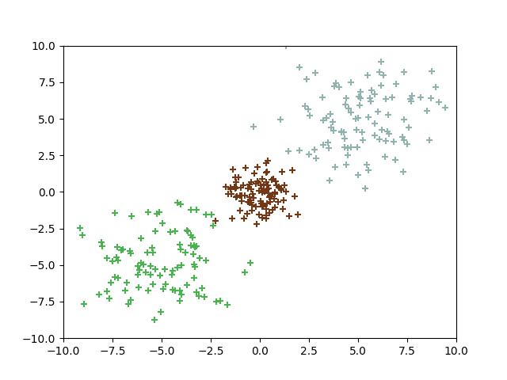

聚类算法得到的结果：

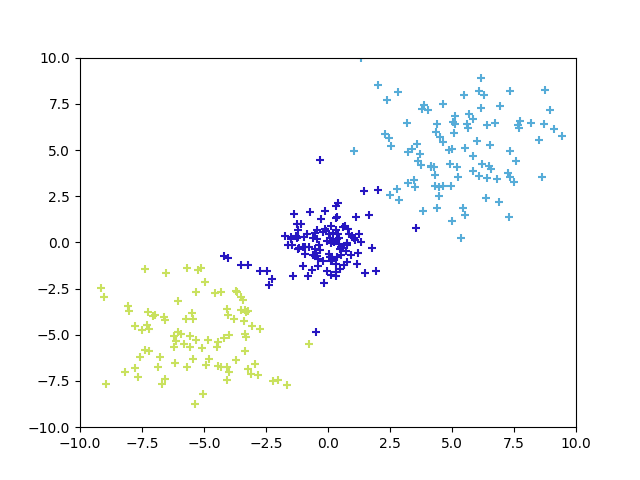

可以看到对class1和class2，class1和class3边界的少部分样本发生了错分。

### case3

对各个样本数目偏差加大的样本集运用此算法

```python
    class1 = generate(0, 0, 1, 1, 5, 0)	#中心为(0,0), 标准差为(1,1), 数目为5个
    class2 = generate(5, 5, 1, 1, 100, 1)	#中心为(5,5), 标准差为(1,1), 数目为100个
    class3 = generate(-5, -5, 1, 1, 100, 2)	#中心为(-5,-5), 标准差为(1,1), 数目为100个
    s = np.vstack((class1, class2, class3))	#讲三类样本聚合
    #初始划分随机选择
```

生成的样本分布：

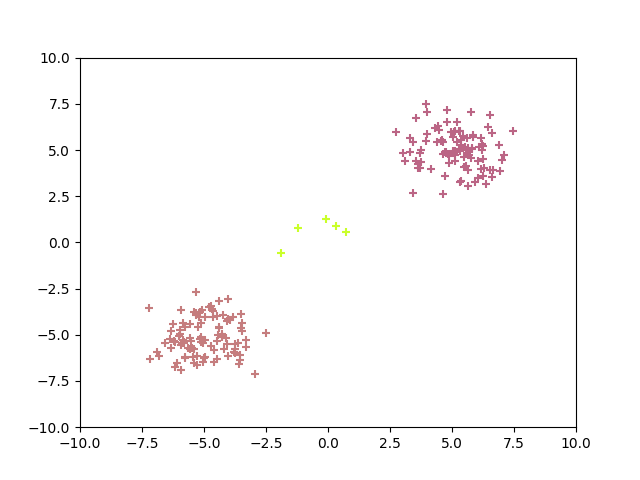

聚类算法得到的结果：

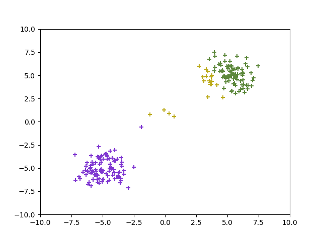

可以看多此时`c-mean`算法对较多的样本分类都发生了错误，甚至讲class2分为了两部分

### case4

初始分布对分类结果也有比较大的影响

同样还是正对case3中数目比较悬殊的样本集合，但是人为固定初始聚类中心

```
    class1 = generate(0, 0, 1, 1, 5, 0)	#中心为(0,0), 标准差为(1,1), 数目为5个
    class2 = generate(5, 5, 1, 1, 100, 1)	#中心为(5,5), 标准差为(1,1), 数目为100个
    class3 = generate(-5, -5, 1, 1, 100, 2)	#中心为(-5,-5), 标准差为(1,1), 数目为100个
    s = np.vstack((class1, class2, class3))	#讲三类样本聚合
    #初始聚类中心固定
```

生成的样本分布：

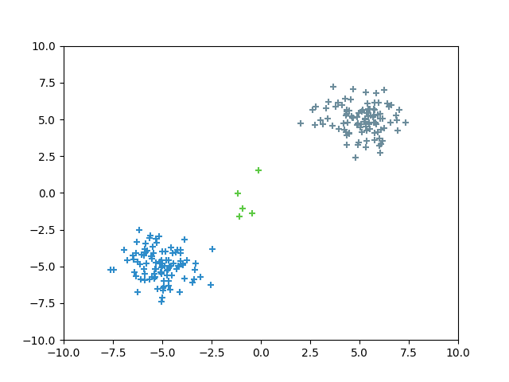

情况1，选择聚类中心为(0, 0) , (5, 5), (-5, -5)由样本的生成函数可知，此为最为理想的划分情况，得到的聚类结果也没有发生错误

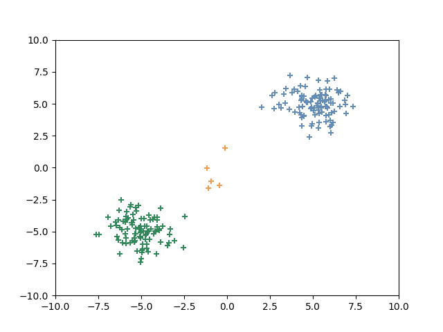

选取另外一种不是非常合理的初始聚类中心（6，5） （4，5），（5，5），此时聚类算法`c-mean`就发生了大量的分类错误：

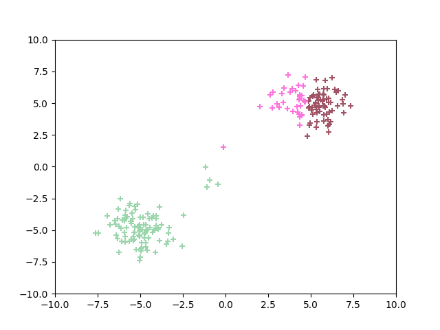

可见，在一定程度中初始聚类中心的选择也极大的影响了聚类算法`c-mean`的结果。

---

* **试就不同的初始分划，观察集群结果对初始分划的敏感性。** 

   不用的初始发挥对集群结果有比较大的影响，尤其是当各个类别分布不够集中，各个类别数目差距比较悬殊的时候，初始分划极大影响了聚类结果。如`case4`，当初始分化比较合理时，不仅迭代轮数短，而且聚类效果好；当初始划分分布比较密集时，不仅迭代轮数长，而且聚类效果也不是非常好。

  但是对各个类别分布集中，各个类别数目差距不大的情况，初始样本对聚类结果影响就不是非常大了。

* **比较各群样本都很密集并且彼此明显分开的情况与各群样本数目相差很大时，误差平方和集群效果，了解误差平方和准则函数集群的优势和缺陷。**

  优点：

  * 实现比较简单
  * 对各类样本比较密集，且样本数目悬殊不大的样本分布效果比较好

  缺点：

  * 对样本分布比较松散，样本数目比较悬殊的样本分布不能很好的发挥作用

* **试对算法进行适当改进使其可以对样本数目相差很大的情况进行集群，用文字叙述改进的思路。（选做）** 

  * 对样本集进行两次聚类

    * 第一次，将样本集聚类成（总样本数 / 最小的类别的样本个数）类
    * 第二次，将第一得到的各个类是为一个整体，按同样的算法进行聚类（合并）成指定数目的类

  * 例子：

    对样本集(如下)，先聚类成21个类，再对21个类进行合并，直到类的个数为3个

    ```python
        class1 = generate(0, 0, 1, 1, 5, 0)	#中心为(0,0), 标准差为(1,1), 数目为5个
        class2 = generate(5, 5, 1, 1, 100, 1)	#中心为(5,5), 标准差为(1,1), 数目为100个
        class3 = generate(-5, -5, 1, 1, 100, 2)	#中心为(-5,-5), 标准差为(1,1), 数目为100个
        s = np.vstack((class1, class2, class3))	#讲三类样本聚合
    ```

    