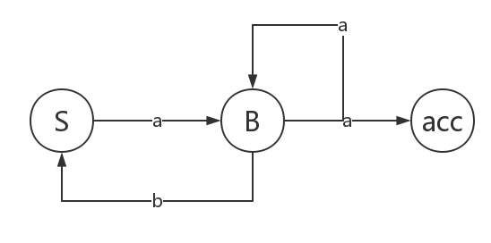
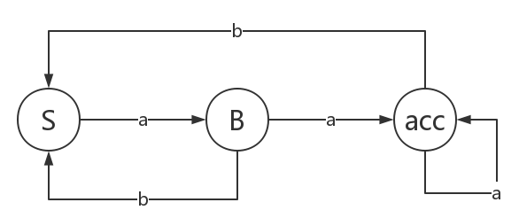

[TOC]

# 实验三 利用有限自动机算法的正规语言的句法分析 

## 实验目的

1. 了解正规语言
2. 实现正规语言的有限自动机算法的句法分析

## 实验要求

给定正规文法 G = { V~n~ , V~t~ , P , S } V~n~ = { S, B } V~t~ = { a, b }

P : S -> aB

B -> bS 

B -> aB 

B -> a

构造确定的有限自动机后，编制确定的有限自动机算法，并分析链：

检验 X = aababaaababaaa 和 X = ababaababaaba 是否能被G接收

* 总结出能被接收的的链的一般特征
* 分析正规文法和确定的有限自动机的联系并撰写实验报告

## 实验原理

### 正规文法

3型文法也叫正规文法，它对应于有限状态自动机。它是在2型文法的基础上满足:A→α|αB（右线性）或A→α|Bα（左线性）。

如有：A->a, A->aB, B->a, B->cB，则符合3型文法的要求。但如果推导 为:A->ab, A->aB, B->a, B->cB 或推导 为:A->a, A->Ba, B->a, B->cB 则不符合3型方法的要求了。

具体的说，例子 A->ab, A->aB, B->a, B->cB 中的 A->ab 不符合3型文法的定义,如果把后面的ab,改成“一个非终结 符＋一个终结符”的形式（即为aB）就对了。

例子 A->a, A->Ba, B->a, B->cB 中如果把B->cB改为 B->Bc的形式就对了,因为A→α|αB（右线性）和A→α|Bα（左线性）两套规则不能同时出现在一个语法中,只能完全满足其中的一个,才能算3型文法。

### 有限状态自动机

有限状态自动机（FSM "finite state machine" 或者FSA "finite state automaton" ）是为研究有限内存的计算过程和某些语言类而抽象出的一种计算模型。有限状态自动机拥有有限数量的状态，每个状态可以迁移到零个或多个状态，输入字串决定执行哪个状态的迁移。有限状态自动机可以表示为一个有向图。有限状态自动机是自动机理论的研究对象。

## 实验实现（python)

对正规文法，我们可以构造有限状态机来实现句法分析，转化为有限状态机的算法也比较简单，转换结果如图：


但是此状态机为不确定有限状态机，用算法实现比较困难，所以我们要进一步将其转化为确定有限自动状态机。最终的状态机如图：



根据此确定的有限状态机撰写代码即可

```python
input1 = "aababaaababaaa"
input2 = "ababaababaaba"

def judge(input : str):
    S = 0
    B = 1
    acc = 2
    status = S
    for char in input:
        if status == S:
            if char == "a":
                status = B
            else:
                return False
        elif status == B or status == acc:
            if char == "a":
                status = acc
            elif char == "b":
                status = S
            else:
                return False
        else:
            return False
    if status == acc:
        return True
    else:
        return False

if __name__ == "__main__":
    print(judge(input1))
    print(judge(input2))
```

## 实验结果及分析

```shell
$ python automata.py
True
False
```

由输出结果，可以知道：

* 对 X = aababaaababaaa, 能被文法G接收
* 对 X = ababaababaaba, 不能被文法G接收

事实上此正规文法和正规表达式 `a ( a | ba )* a`等价

只要字符串符合正规表达式 `a ( a | ba )* a`，就能被文法G接受

### 正规文法G和确定有限自动状态机和正规表达式的关系

我们有以下定理：

* 每一个正规文法G有能与之对应的不确定有限状态机相互转化
* 存在确定的有限状态机和不确定的有限状态机等价
* 对每一个正规表达式，有与子等价的确定有限状态机

由上述三条定理，易知正规文法和正规表达式等价，并且存在确定的有限自动状态机和正规文法等价。因而对判断某模式能否被某正规文法接受一种行之有效的方法是，构造与正规文法等价的确定有限自动状态机进行句法分析。

## reference

[有限状态自动机](https://baike.baidu.com/item/有限状态自动机)

[chomsky文法分类0123型](https://zhuanlan.zhihu.com/p/37900700)

